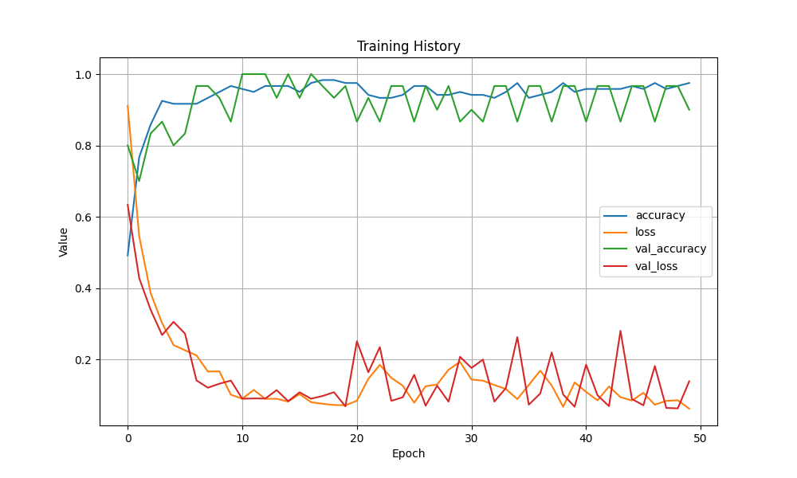
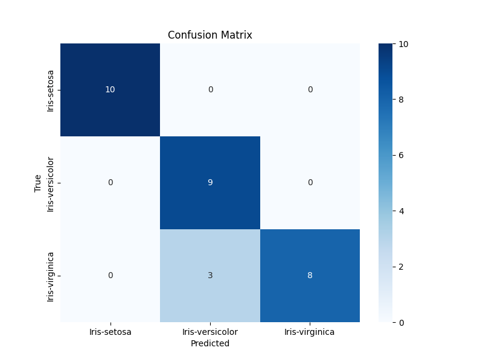

# Klasifikasi Bunga Iris Menggunakan Deep Learning

Repositori ini berisi implementasi model *Artificial Neural Network* (ANN) untuk mengklasifikasikan spesies bunga Iris berdasarkan fitur morfologinya menggunakan pustaka TensorFlow/Keras.

## Ringkasan Proyek

Dataset yang digunakan adalah **Iris Dataset**, yang terdiri dari 150 data sampel bunga dengan 4 fitur utama:
1. *Sepal Length*
2. *Sepal Width*
3. *Petal Length*
4. *Petal Width*

Tujuan utama dari proyek ini adalah memprediksi salah satu dari tiga kelas spesies: **Setosa**, **Versicolor**, atau **Virginica**.

---

## Analisis Arsitektur Model

Model dibangun dengan struktur *Deep Neural Network* sebagai berikut:

- **Layer Input**: Menerima 4 fitur input.
- **Hidden Layer 1**: 1000 neuron dengan fungsi aktivasi *ReLU*.
- **Hidden Layer 2**: 500 neuron dengan fungsi aktivasi *ReLU*.
- **Hidden Layer 3**: 300 neuron dengan fungsi aktivasi *ReLU*.
- **Layer Output**: 3 neuron dengan fungsi aktivasi *Softmax* untuk klasifikasi multi-kelas.

---

## Hasil dan Visualisasi

Setelah melatih model selama 50 epoch, berikut adalah hasil evaluasi performa yang didapatkan:

### 1. Riwayat Pelatihan (Training History)
Grafik di bawah ini menunjukkan pergerakan nilai *Loss* dan *Accuracy* selama proses pelatihan berlangsung.



### 2. Confusion Matrix
Matriks ini menggambarkan seberapa akurat model dalam memprediksi data pada set pengujian (*Test Set*).



*Berdasarkan matriks di atas, kita dapat melihat distribusi prediksi benar dan salah untuk setiap spesies.*

---

## Cara Penggunaan

### Prasyarat
Pastikan Anda telah menginstal pustaka yang diperlukan:
```bash
pip install tensorflow pandas numpy matplotlib seaborn scikit-learn
```

### Menjalankan Program
1. Eksekusi script utama:
   ```bash
   python iris.py
   ```
2. Program akan melatih model, menampilkan visualisasi, dan menyimpannya sebagai file `.png`.
3. Setelah grafik ditutup, Anda dapat memasukkan nilai fitur secara manual untuk mencoba prediksi data baru langsung di terminal.

---

## Struktur File
- `iris.py`: Script utama (Pre-processing, Modeling, Evaluation).
- `iris.csv`: Dataset mentah.
- `training_history.png`: Hasil plot riwayat pelatihan.
- `confusion_matrix.png`: Hasil visualisasi matriks kebingungan.
- `README.md`: Dokumentasi proyek.
